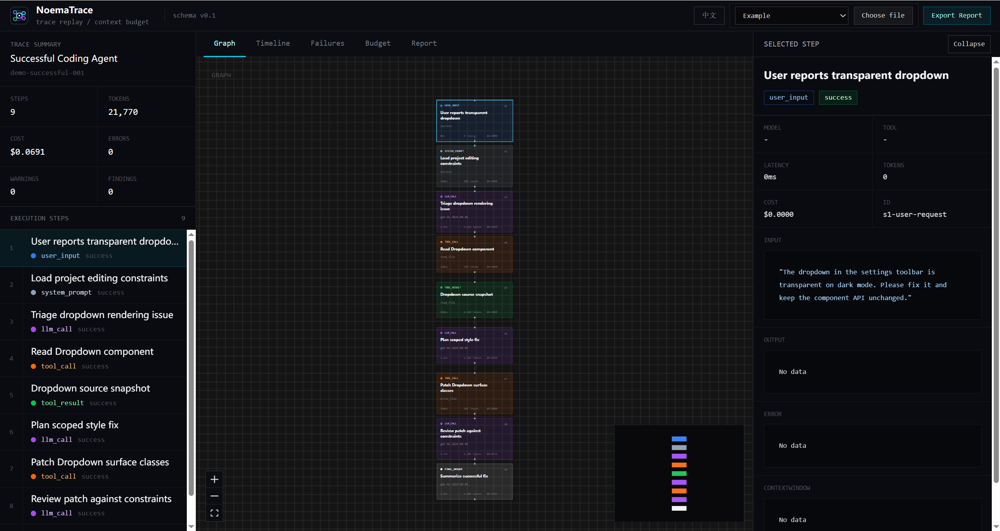

# NoemaTrace

**AI Agent Trace Replayer & Context Budget Analyzer**

[中文 README](README.md) · [GitHub Repository](https://github.com/kllin8154-arch/noematrace)

NoemaTrace is an offline-first frontend tool for inspecting a single AI agent run. Drop in a trace JSON file and it visualizes the execution graph, timeline, failures, token usage, cost, and context-window budget.

No backend. No database. No account. No LLM API calls. It is a local debugging workbench for understanding why an agent behaved the way it did.



> Current version: v0.1, actively evolving.

## What Problem Does It Solve?

An agent run is rarely a single response. It is a sequence of user input, prompts, model calls, tool calls, retries, failures, retrieved context, and final output.

Raw logs make that hard to reason about. NoemaTrace turns one run into an interactive view so you can answer:

1. Why did the agent produce this result?
2. Should the next fix be in the prompt, tools, retrieval, retry logic, or execution policy?

## When Would You Use It?

- Debug a coding agent that repeatedly reads the same file.
- Spot repeated tool calls with identical arguments.
- Explain an error cascade after the first failed command.
- Understand why the context window is full but not useful.
- Identify high-token or high-cost steps.
- Teach or document how agent traces work.

## Quick Start

```bash
git clone https://github.com/kllin8154-arch/noematrace.git
cd noematrace
npm install
npm run dev
```

Open `http://localhost:5173`, choose a built-in demo trace, or drag in your own trace JSON.

Useful checks:

```bash
npm run lint
npx vitest run
npm run build
```

## Built-In Demos

| Demo | Scenario | Demonstrates |
| --- | --- | --- |
| successful-coding-agent | Agent fixes a transparent dropdown in `src/components/Dropdown.tsx` | Graph, timeline, detail panel, context budget |
| failed-tool-loop | Agent reads `DateRangePicker.tsx` 5 times with identical arguments | Repeated tool call, high-cost node |
| error-cascade | A missing test setup file causes dependent commands to fail | Error cascade |
| context-waste-run | Tool descriptions and overlapping retrieved chunks dominate context | Unused context, context budget recommendations |

## Features

- **Graph**: view the parent-child execution tree.
- **Timeline**: inspect step order and latency.
- **Failure Analysis**: rule-based findings for repeated tool calls, high-cost nodes, error cascades, unused context, and risky tool calls.
- **Context Budget**: break down context-window tokens by category.
- **Report**: copy or download a Markdown report.
- **Bilingual UI**: Chinese and English switching for the UI, findings, recommendations, demos, and reports.

## Tech Stack

React · Vite · TypeScript · Tailwind CSS · Zustand · Zod · `@xyflow/react` · elkjs · Recharts · highlight.js · Vitest

## Trace Format

NoemaTrace reads JSON with `schemaVersion: "0.1"`.

Key concepts:

- `AgentTrace`: one agent run.
- `TraceStep`: one execution step.
- `parentId`: tree relationship.
- `order`: execution order.
- `contextWindow`: context-budget data on `llm_call` steps.
- `Finding`: analyzer output.

The authoritative schema lives in `src/types/schema.ts`.

## What It Is Not

NoemaTrace is not:

- a LangSmith / Langfuse replacement
- a production monitoring system
- a backend observability platform
- a trace collection SDK
- an LLM-powered auto-debugger

It is a local-first tool for replaying and understanding one agent run at a time.

## License

MIT
