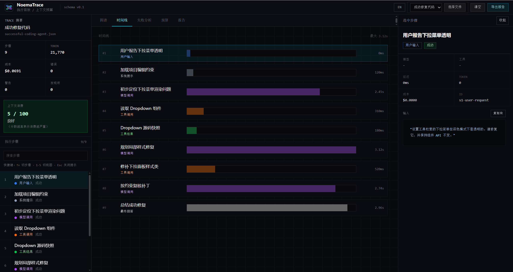
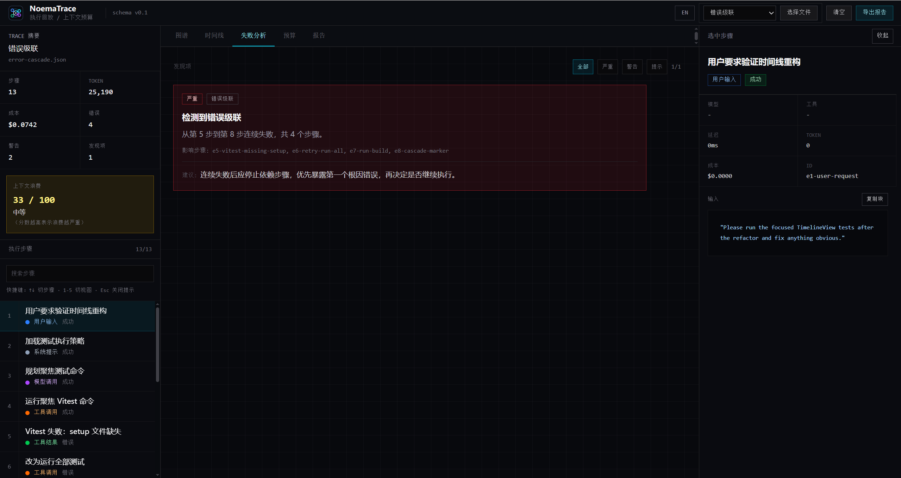
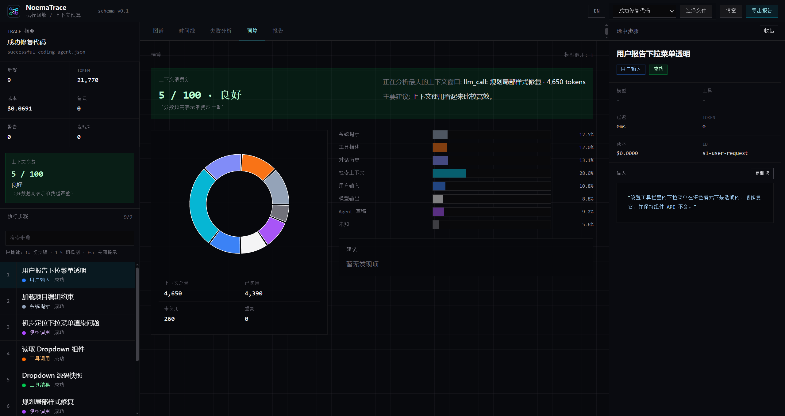

# NoemaTrace

[English](README.en.md) · [在线访问](https://noematrace.vercel.app) · [GitHub](https://github.com/kllin8154-arch/noematrace)

唯一一个会给上下文窗口浪费程度打分的 Agent trace viewer。

NoemaTrace 是一个零配置、纯前端、离线优先的 AI Agent trace 查看器。把 trace JSON 拖进浏览器，就能看清一次 agent run 的执行路径、工具调用、失败原因、token 成本、上下文预算和 Context Waste Score。

**在线体验：** [https://noematrace.vercel.app](https://noematrace.vercel.app)


## 界面截图

| | |
| --- | --- |
|  |  |
|  |  |
|  |  |
|  | |

## 它解决什么问题

一次 Agent 执行通常不是“一问一答”。它可能包含用户输入、系统提示词、模型调用、工具调用、检索上下文、重试、错误和最终回答。

原始日志很难读。NoemaTrace 把一份 trace JSON 变成可交互界面，让你快速回答：

1. Agent 每一步到底做了什么？
2. 它为什么失败、卡住或重复调用工具？
3. 哪一步消耗了最多 token、时间或成本？
4. 上下文窗口里哪些内容真正被用到，哪些只是浪费？
5. 这次修复应该改 prompt、工具、检索、重试逻辑，还是执行策略？

## 适用场景

- 调试一个反复读取同一文件的 coding agent。
- 复盘一次工具调用失败后的错误级联。
- 找出高 token、高成本或高延迟的关键步骤。
- 分析 RAG / Agent 上下文窗口中未使用、重复或过大的内容块。
- 给团队演示 agent trace、上下文预算和失败分析是怎么工作的。
- 在不接入后端、不上传数据、不改业务代码的情况下检查一次 agent run。

## 为什么是 NoemaTrace

很多 agent 调试工具需要后端、采集器、SDK、数据库或 CLI。NoemaTrace 选择更窄但更轻的路线：只读取一个 trace 文件，让你尽快看懂这一轮发生了什么。

| 差异点 | 对使用者意味着什么 |
| --- | --- |
| 纯前端，零后端 | 没有服务端、数据库、账号系统和 API key。打开网页，拖入 JSON 即可使用。 |
| Context Waste Score | 其他工具多关注 replay 或 diff。NoemaTrace 额外量化上下文浪费：未使用内容、重复内容、工具描述过重、历史对话过大等都会进入评分。 |
| 无 SDK 侵入 | 只读 trace 文件，不要求你改 agent 代码、安装运行时 SDK，或把数据发到托管平台。 |

## 和其他工具的区别

Langfuse 和 LangSmith 这类工具是生产级观测平台；agenttrace、agent-replay 这类本地调试器通常需要后端或 CLI 设置。NoemaTrace 放弃持久化和实时采集，换来零配置检查：拖入 JSON，直接阅读。

## 快速开始

```bash
git clone https://github.com/kllin8154-arch/noematrace.git
cd noematrace
npm install
npm run dev
```

打开 `http://localhost:5173`，选择内置 demo trace，或拖入你自己的 NoemaTrace `schemaVersion: "0.1"` JSON 文件。

常用检查命令：

```bash
npm run lint
npx vitest run
npm run build
```

生产构建输出目录是 `dist`。

## 核心视图

### Graph

把 agent run 渲染成执行树。节点关系来自 `parentId`，界面会自动布局，方便追踪计划、工具调用、工具结果、重试和最终回答。

### Timeline

按 `order` 查看执行顺序。每个 step 按类型着色，并按延迟显示长度，方便发现慢模型调用、重复工具调用和浪费的重试。

### Failures

展示规则分析结果，包括重复工具调用、高成本节点、错误级联、未使用上下文和实验性的危险工具调用。每条 finding 都能定位到相关 step。

### Budget

拆解 `llm_call` 上标注的 `contextWindow`，查看 system prompt、tool descriptions、conversation history、retrieved context、user input、model output、scratchpad 和 unknown 的占比。

### Waste Score

Context Waste Score 把上下文工程问题变成一个可扫读的检查信号。分数越高，说明未使用内容、重复内容、过大的工具描述、过长历史或高 token 步骤带来的浪费越明显。

## 内置 Demo

| Demo | 场景 | 适合观察 |
| --- | --- | --- |
| `successful-coding-agent.json` | Coding agent 修复 React 组件里的透明下拉菜单问题。 | Graph、Timeline、详情面板、报告导出、均衡的上下文预算。 |
| `failed-tool-loop.json` | Agent 用相同参数反复读取同一个文件。 | Repeated Tool Call 和 High Cost Node。 |
| `error-cascade.json` | 命令失败后触发连续的后续失败。 | Error Cascade 和浪费的重试时间。 |
| `context-waste-run.json` | 工具描述和重复检索内容撑大上下文窗口。 | Unused Context、Context Budget 建议和 Context Waste Score。 |

## Trace 格式

NoemaTrace 读取 `schemaVersion: "0.1"` 的 JSON。

核心概念：

- `AgentTrace`：一次 agent run。
- `TraceStep`：一次执行步骤。
- `parentId`：执行树关系。
- `order`：执行顺序。
- `contextWindow`：只出现在 `llm_call` step 上的上下文预算数据。
- `Finding`：规则分析器输出的问题和建议。

权威类型定义在 `src/types/schema.ts`。

## Not a Platform

NoemaTrace 不是生产环境观测平台。

它不提供：

- 后端服务
- 用户账号
- 数据库或持久化
- 实时监控
- 托管 trace 采集
- trace 采集 SDK
- LLM API 调用

它是一个面向单次 agent run 的本地检查工具。如果你需要生产追踪、告警、留存、团队协作或线上仪表盘，请使用专门的平台。如果你手上有一份 trace JSON，想尽快看懂发生了什么，NoemaTrace 就是为这个场景做的。

## License

MIT
