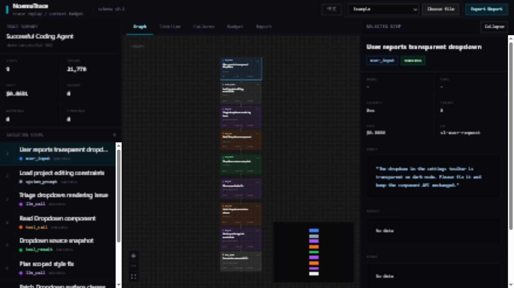

# NoemaTrace

**AI Agent 执行回放与上下文预算分析工具**

[English README](README.en.md) · [GitHub 仓库](https://github.com/kllin8154-arch/noematrace)

NoemaTrace 是一个离线优先的纯前端开发者工具。你把一次 AI Agent 运行产生的 trace JSON 拖进去，它会把这次运行拆成图谱、时间线、失败原因、Token 成本和上下文预算，让你看清楚 Agent 到底怎么想、怎么调用工具、哪里浪费了上下文、为什么失败。

它不是平台，也不需要账号、后端或数据库。它更像一个本地调试台：当 Agent 跑偏、重复读文件、连续失败、上下文塞太满时，用它复盘一次具体运行。



> 当前版本：v0.1，仍在快速迭代中。

## 这个项目解决什么问题

AI Agent 的一次运行通常不是“一问一答”，而是一串步骤：

- 用户输入了什么
- 系统提示词和约束是什么
- 模型在哪些步骤做了推理
- 调用了哪些工具，参数是什么
- 哪一步失败，后面是否继续错误重试
- 哪一步消耗了最多 Token 或成本
- context window 里哪些内容真正有用，哪些只是被带着浪费

如果只看终端日志，这些信息很容易散在一长串文本里。NoemaTrace 把它们结构化成一个可交互界面，帮助你更快回答两个问题：

1. 这次 Agent 为什么得到这个结果？
2. 下一次应该改 prompt、工具、检索还是执行策略？

## 什么时候别人会用到它

- **调试代码 Agent**：Agent 一直读同一个文件、重复跑命令，却没有真正定位问题。
- **复盘工具调用循环**：同一个 `read_file` / `web_search` / `shell` 参数重复出现，说明规划或重试逻辑有问题。
- **定位错误级联**：第一个测试失败后，后续命令都基于同一个错误继续失败。
- **分析上下文浪费**：tool description、历史对话或检索片段占满 context window，但模型其实没有用到。
- **优化成本**：找出单个高 Token / 高成本步骤，决定是否拆分、压缩或换模型。
- **教学和开源演示**：用可视化方式解释 Agent trace、上下文预算和 rule-based analyzer。

## 快速开始

```bash
git clone https://github.com/kllin8154-arch/noematrace.git
cd noematrace
npm install
npm run dev
```

打开 `http://localhost:5173`，选择内置示例，或拖入自己的 trace JSON。

常用验证命令：

```bash
npm run lint
npx vitest run
npm run build
```

## 内置 Demo

| Demo | 场景 | 主要展示 |
| --- | --- | --- |
| successful-coding-agent | Agent 修复 `src/components/Dropdown.tsx` 的透明下拉菜单 | 图谱、时间线、详情、上下文预算 |
| failed-tool-loop | Agent 用相同参数重复读取 `DateRangePicker.tsx` 5 次 | 重复工具调用、高成本节点 |
| error-cascade | 测试配置缺失导致连续命令失败 | 错误级联 |
| context-waste-run | 工具描述和重复检索片段占用大量上下文 | 未使用上下文、上下文预算建议 |

## 界面功能

- **图谱**：用执行树查看每个 step 的父子关系。
- **时间线**：按执行顺序和耗时查看慢步骤。
- **失败分析**：自动标记重复工具调用、高成本节点、错误级联、未使用上下文和危险工具调用。
- **上下文预算**：按系统提示、工具描述、对话历史、检索上下文等类别拆分 Token 占比。
- **报告**：生成 Markdown 报告，可复制或下载。
- **中英文切换**：界面、示例标题、分析发现、预算建议和报告支持中英文切换。

## 技术栈

- React + Vite + TypeScript
- Tailwind CSS
- Zustand
- Zod
- `@xyflow/react`
- elkjs
- Recharts
- highlight.js
- Vitest

如果你是边学边做，建议从“这个项目解决什么问题”“内置 Demo”“Trace 数据格式”三节开始读，再进入源码。

## Trace 数据格式

NoemaTrace 读取符合 `schemaVersion: "0.1"` 的 JSON。核心结构是：

- `AgentTrace`：一次 Agent 运行。
- `TraceStep`：运行中的一个步骤。
- `parentId`：表达步骤之间的树关系。
- `order`：表达执行顺序。
- `contextWindow`：只出现在 `llm_call` 步骤上，用于上下文预算分析。
- `Finding`：规则分析器输出的问题或风险。

权威类型定义在 `src/types/schema.ts`。

## 它不是

NoemaTrace 当前不是：

- LangSmith / Langfuse 替代品
- 生产监控系统
- 后端可观测性平台
- trace 采集 SDK
- 会调用 LLM API 的自动分析工具

它是一个本地、离线、单次运行复盘工具。

## 贡献

欢迎 issue、PR 和 demo trace。当前项目更重视两类贡献：

- 更真实的 Agent trace 示例
- 更稳定、可解释的 rule-based analyzer

涉及依赖 API、import 路径或构建配置时，请先确认当前项目实际安装版本，避免照搬旧版本写法。

## License

MIT
