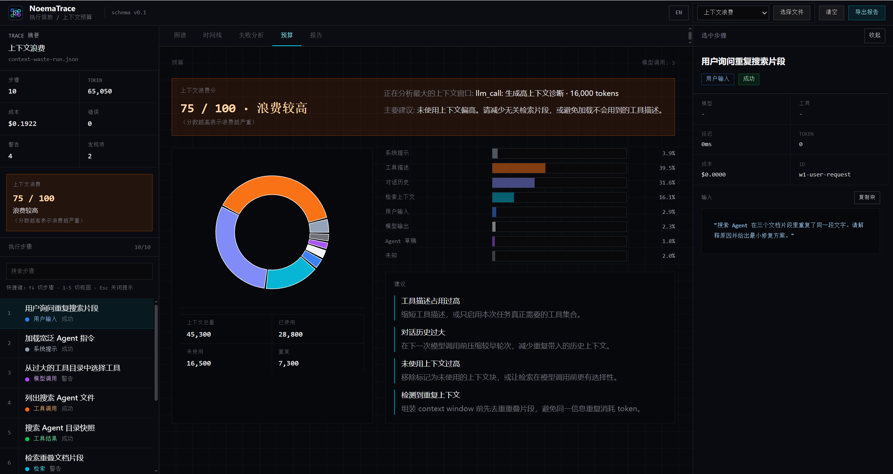
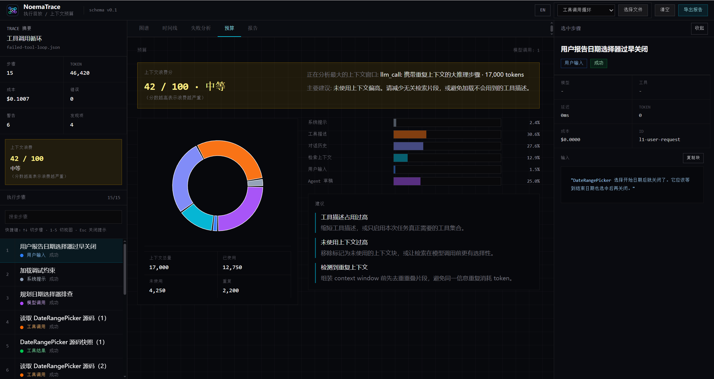
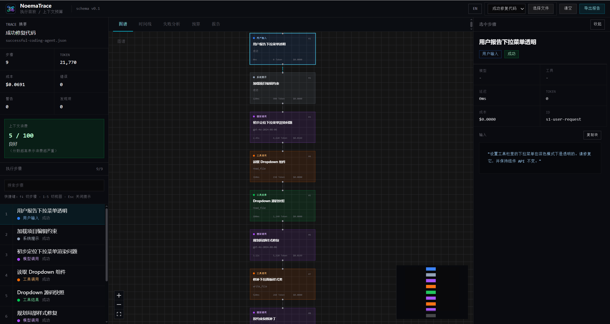
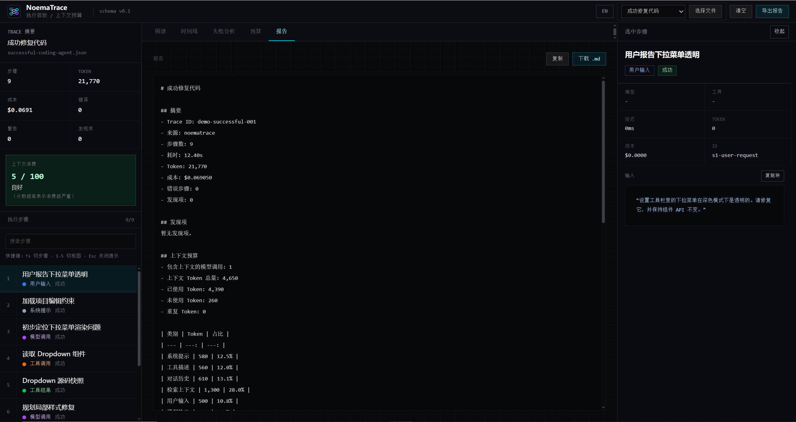

# NoemaTrace

[English](README.en.md) · [Live Demo](https://noematrace.vercel.app/) · [GitHub Repo](https://github.com/kllin8154-arch/noematrace)

**Browser-only Agent Trace Replayer with Context Waste Score**

> 拖入一份 trace JSON，立刻检查 Agent 的执行路径、时间线、失败原因、Token 使用量，以及上下文窗口浪费了多少。



No backend. No database. No SDK. No signup. Just drag, replay, inspect.

NoemaTrace 的关键差异是 **Context Waste Score**：它用规则分析上下文窗口中未使用、重复、过大或被工具描述占满的内容，让你知道 Agent 不是只“用了多少 token”，而是“浪费了多少上下文”。

## 它解决什么问题

一次 Agent 执行通常不是一问一答。它可能包含用户输入、系统提示词、模型调用、工具调用、检索上下文、重试、错误和最终回答。

原始日志很难读。NoemaTrace 把一份 trace JSON 变成可交互界面，让你快速回答：

1. Agent 每一步到底做了什么？
2. 它为什么失败、卡住或重复调用工具？
3. 哪一步消耗了最多 token、时间或成本？
4. 上下文窗口里哪些内容真正被用到，哪些只是浪费？
5. 这次修复应该改 prompt、工具、检索、重试逻辑，还是执行策略？

## 适用场景

- 调试一个反复读取同一文件的 coding agent。
- 复盘一次工具调用失败后的错误级联。
- 找出高 token、高成本或高延迟的关键步骤。
- 分析 RAG / Agent 上下文窗口中未使用、重复或过大的内容块。
- 给团队演示 agent trace、上下文预算和失败分析是怎么工作的。
- 在不接入后端、不上传数据、不改业务代码的情况下检查一次 agent run。

## How It Differs

Agent observability、replay 和生产追踪领域已经有很多成熟工具。NoemaTrace 只聚焦一个更窄的工作流：

**single-run, zero-setup, browser-only inspection of agent traces with context waste diagnostics.**

- **Production platforms** like Langfuse and LangSmith are built for continuous tracing, dashboards, datasets, and team workflows.
- **Local debuggers** may require a backend, database, SDK, CLI setup, or trace capture layer.
- **NoemaTrace** trades persistence and live capture for the lowest possible inspection path: drag in a trace JSON and inspect it in the browser.

NoemaTrace 的不同点：

- **Pure frontend**：没有后端、数据库或本地服务。
- **No SDK required**：读取 trace 文件，不负责采集 trace。
- **Context Waste Score**：量化未使用、重复、过大、工具描述过重的上下文。
- **Offline-first**：所有分析都在浏览器本地运行。
- **Rule-based analysis**：不调用 LLM API，不需要 API key，也没有隐藏评分。

## Quick Start

```bash
git clone https://github.com/kllin8154-arch/noematrace.git
cd noematrace
npm install
npm run dev
```

打开 `http://localhost:5173`，选择内置 demo trace，或拖入你自己的 NoemaTrace `schemaVersion: "0.1"` JSON 文件。

常用检查命令：

```bash
npm run lint
npx vitest run
npm run build
```

生产构建输出目录是 `dist`。`package.json` 当前没有 `test` script，所以测试命令使用 `npx vitest run`。

## Feature Overview

### Graph View

Graph View 显示基于 `parentId` 的父子执行树，帮助你理解 Agent 的决策流、工具调用、工具结果、重试和最终回答之间的关系。

### Timeline View

Timeline View 按执行顺序展示每个 step 的耗时，帮助识别慢 LLM 调用、慢工具调用和重复重试带来的时间浪费。

### Failure Analysis

Failure Analysis 使用规则检测：

- Repeated Tool Call
- Error Cascade
- High Cost Node
- Unused Context
- Risky Tool Call experimental

每条 finding 都会给出受影响 step 和建议。

### Context Budget

Context Budget 展示已标注 `contextWindow` 的组成，包括 system prompt、tool descriptions、conversation history、retrieved context、user input、model output、agent scratchpad 和 unknown。

NoemaTrace does not infer context composition from total token counts. If `contextWindow` is missing, the score is unavailable.

### Context Waste Score

Context Waste Score 越高，表示上下文浪费越严重。它基于最大的已标注 `llm_call` context window，使用规则计算未使用内容、重复内容、工具描述占比、历史对话占比和高 token step 风险。

它是 rule-based，不是 LLM scoring；NoemaTrace 不会调用模型 API 来给 trace 打分。

## Screenshots

### Context Waste Score


### Moderate Waste Example



### Graph View



### Timeline View


### Failure Analysis


### Context Budget


### Report Export



## Demo Traces

| Demo | Scenario | Demonstrates |
| --- | --- | --- |
| `successful-coding-agent.json` | Successful UI bug fix | Low waste score, graph, timeline, report |
| `failed-tool-loop.json` | Repeated `read_file` loop | Repeated tool call, moderate waste |
| `error-cascade.json` | Shell failures and retries | Error cascade, retry overhead |
| `context-waste-run.json` | Tool-heavy context pollution | High Context Waste Score, unused context |

## Trace 格式

NoemaTrace 读取 `schemaVersion: "0.1"` 的 JSON。

核心概念：

- `AgentTrace`：一次 agent run。
- `TraceStep`：一次执行步骤。
- `parentId`：执行树关系。
- `order`：执行顺序。
- `contextWindow`：只出现在 `llm_call` step 上的上下文预算数据。
- `Finding`：规则分析器输出的问题和建议。

权威类型定义在 `src/types/schema.ts`。

## Not a Platform

NoemaTrace is not:

- a Langfuse / LangSmith replacement
- a production monitoring system
- a trace collection SDK
- a backend service
- an eval platform

NoemaTrace is:

- a local-first single-run inspector
- a browser-only trace viewer
- a context waste diagnostic tool

如果你需要生产追踪、告警、留存、团队协作或线上仪表盘，请使用专门的平台。如果你手上有一份 trace JSON，想尽快看懂发生了什么，NoemaTrace 就是为这个场景做的。

## License

MIT
